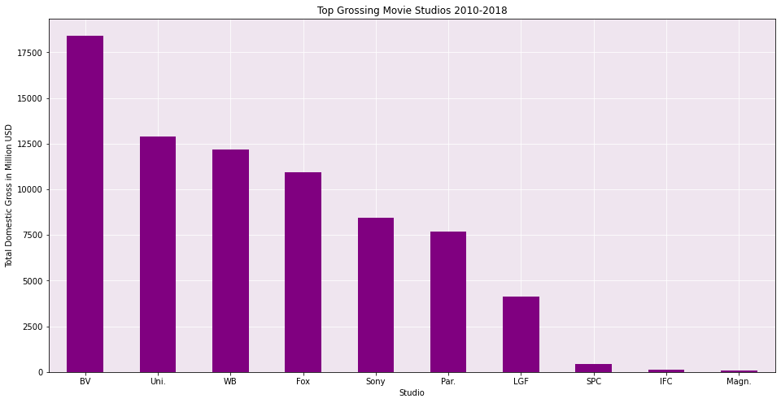
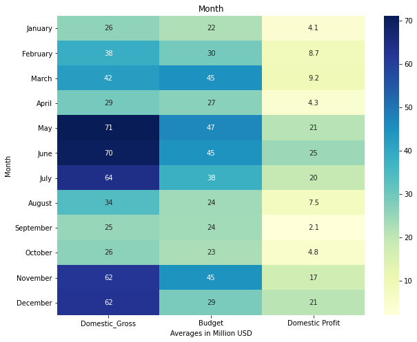
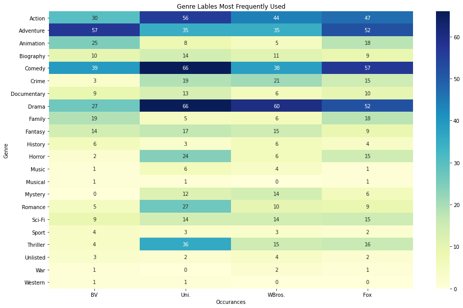

Flatiron Data Science Program
Module 1 Project

September 11, 2020

---

# *Microsoft Goes to The Movies*

*Bill, Melinda... thank you for inviting me into your home!*

*Why yes, of course I'll stay for dinner. But first, let me sing you a song about SHOWBIZ!*

---

### Overview

*A look into the film industry’s domestic performance.*

My client, Microsoft, is interested in starting a new film production studio. They are looking for data supported insight into what types of films they should produce. For this objective, I will investigate which films perform the best at the box office. For this analysis, best = most profitable.

### Data

The following data was used for this project:
All datasets were provided, sourced from IMDB or BOM.
Studio information from 2010-2018 containing studio name, title, domestic and foreign gross in USD.
Movie information with genres was combined with a table of ratings. 

I scrubbed the data of duplicates, missing values and broke apart or merged tables to create the "Clean Data" available in this repo.
Please see my [cleaning notebook](./CleanData/DataCleaning.ipynb) for methodology and cleaning process.

#### 1) Which studios are the domestic leaders?

Top 10 Studios: Buena Vista (Disney), Universal Studios, Warner Brothers, Fox, Sony, Paramount, Lionsgate, Sony Pictures Classic, IFC (Independent Film Channel), and Magnolia Pictures. The top ten studios (3.4%) generate 85.4% of total domestic gross for 39.9% of the content.

#### 2) What are their production numbers?

Focusing on the top four studios, the average number of titles released per year is between 8 and 21. Disney has lower title and higher gross because they have been focusing on their large franchises.

#### 3) What types of movies are they making?

This heatmap shows how often each studio used a specific genre label to describe their titles. The top four genres produced by all four studios are Action, Adventure, Comedy, and Drama.

#### 4) Does release date effect box office success ?

We can see a relationship between release date and performance, with summer having the largest profits recorded. Why does December have such a high gross but poor showing (comparatively) of profit? Its the month when the most movies are released, thus a lot to competition to get theater play time and attract audiences. 

---
### Conclusions

The industry is dominated by the large, well established producers creating between 8 and 21 titles per year.

Action, Adventure, Comedy, and Drama were the most utilized descriptors for the movies from these studios.

Movies released in summer (June, July, August) or for have the greatest ROI.

### Questions to Consider

Will competing directly in the most populous areas be more likely to lead to success, or are those areas too saturated?

Beyond genre – what are the effects of these factors in driving attendance: remakes, sequels/franchises, based on books/other media, talent - cast/crew.

What is profit/ROI relationship to genre? 

### Thank you for viewing my project!

Please review the full analysis in my [Jupyter Notebook](./notebook.pdf) or view my presentation as [sides](./presentation.pdf) or [video]().
